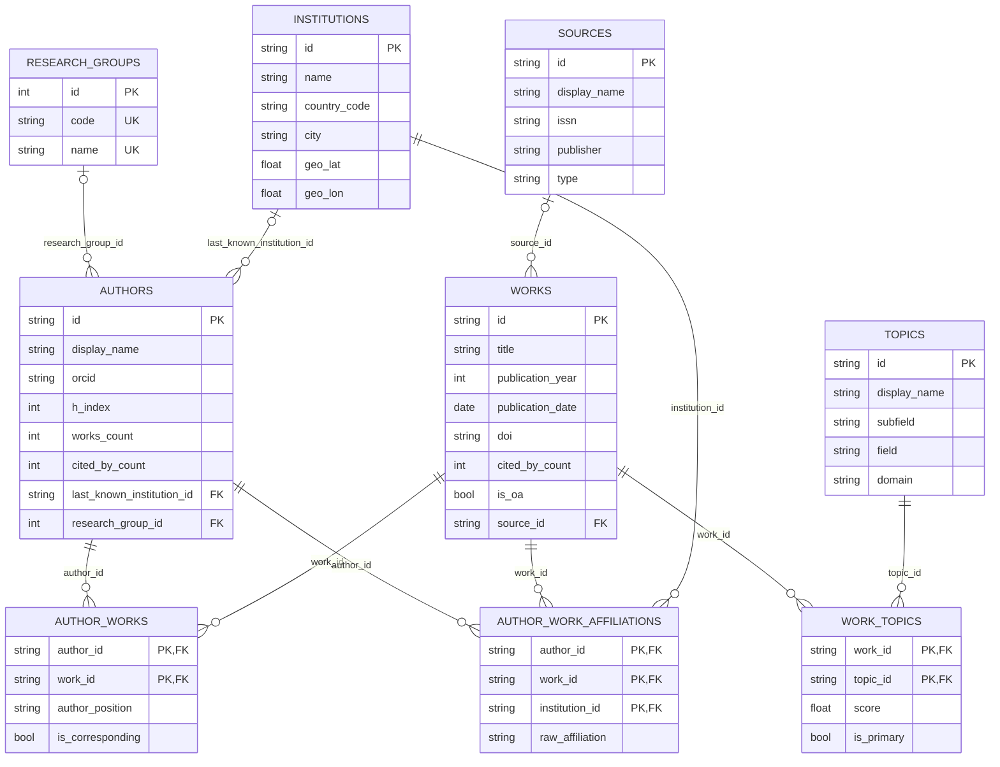
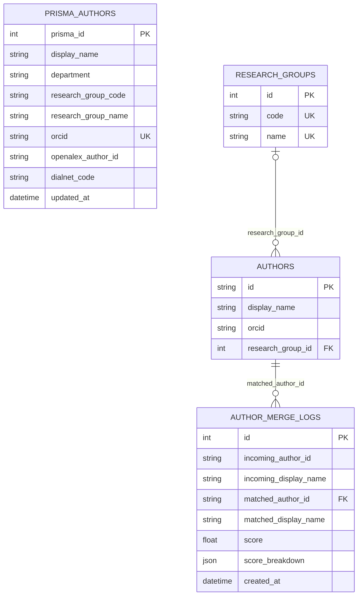

```mermaid
erDiagram
    AUTHORS {
        string id PK
        string display_name
        string orcid
        int h_index
        int works_count
        int cited_by_count
        string last_known_institution_id FK
        int research_group_id FK
    }

    WORKS {
        string id PK
        string title
        int publication_year
        date publication_date
        string doi
        int cited_by_count
        bool is_oa
        string source_id FK
    }

    INSTITUTIONS {
        string id PK
        string name
        string country_code
        string city
        float geo_lat
        float geo_lon
    }

    RESEARCH_GROUPS {
        int id PK
        string code UK
        string name UK
    }

    SOURCES {
        string id PK
        string display_name
        string issn
        string publisher
        string type
    }

    TOPICS {
        string id PK
        string display_name
        string subfield
        string field
        string domain
    }

    AUTHOR_WORKS {
        string author_id PK, FK
        string work_id PK, FK
        string author_position
        bool is_corresponding
    }

    AUTHOR_WORK_AFFILIATIONS {
        string author_id PK, FK
        string work_id PK, FK
        string institution_id PK, FK
        string raw_affiliation
    }

    WORK_TOPICS {
        string work_id PK, FK
        string topic_id PK, FK
        float score
        bool is_primary
    }

    RESEARCH_GROUPS o|--o{ AUTHORS : research_group_id
    INSTITUTIONS o|--o{ AUTHORS : last_known_institution_id
    SOURCES o|--o{ WORKS : source_id

    AUTHORS ||--o{ AUTHOR_WORKS : author_id
    WORKS ||--o{ AUTHOR_WORKS : work_id

    AUTHORS ||--o{ AUTHOR_WORK_AFFILIATIONS : author_id
    WORKS ||--o{ AUTHOR_WORK_AFFILIATIONS : work_id
    INSTITUTIONS ||--o{ AUTHOR_WORK_AFFILIATIONS : institution_id

    WORKS ||--o{ WORK_TOPICS : work_id
    TOPICS ||--o{ WORK_TOPICS : topic_id
```

```mermaid
erDiagram
    PRISMA_AUTHORS {
        int prisma_id PK
        string display_name
        string department
        string research_group_code
        string research_group_name
        string orcid UK
        string openalex_author_id
        string dialnet_code
        datetime updated_at
    }

    AUTHORS {
        string id PK
        string display_name
        string orcid
        int research_group_id FK
    }

    RESEARCH_GROUPS {
        int id PK
        string code UK
        string name UK
    }

    AUTHOR_MERGE_LOGS {
        int id PK
        string incoming_author_id
        string incoming_display_name
        string matched_author_id FK
        string matched_display_name
        float score
        json score_breakdown
        datetime created_at
    }

    RESEARCH_GROUPS o|--o{ AUTHORS : research_group_id
    AUTHORS ||--o{ AUTHOR_MERGE_LOGS : matched_author_id
```
