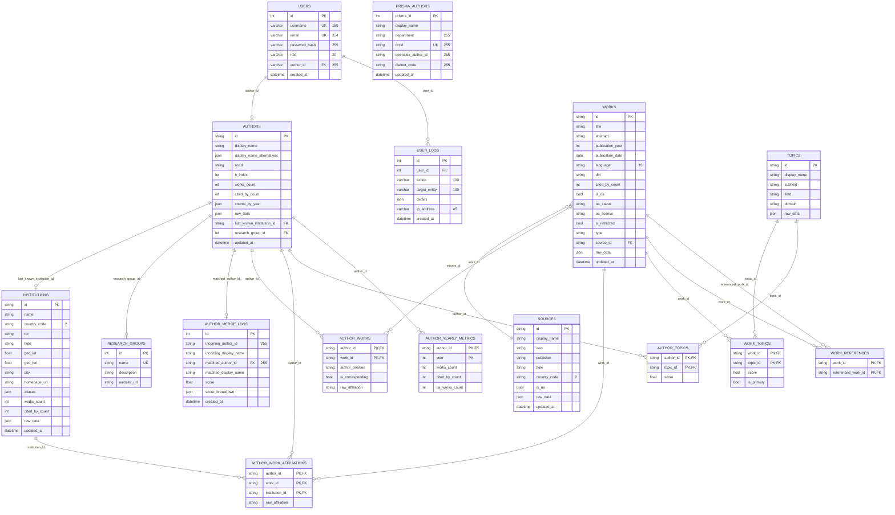

# Current database diagram

This diagram reflects the current schema implemented in the project's SQLModel classes and Alembic migrations

## What this schema covers

- `authors` and `works` provide the core of the researcher API: authors, publications, coauthors, affiliations, and topics.
- `institutions`, `sources`, and `topics` add context for navigation and analysis.
- `research_groups` lets authors be grouped into research teams.
- `prisma_authors` stores raw data scraped from the university's Prisma portal, used to cross-reference and enrich `authors` records (e.g. by ORCID).
- `author_merge_logs` keeps a traceable record of automatic author-matching decisions (incoming identifier vs. matched author, score, and score breakdown).
- `user_logs` and `users` support basic user management and traceability.
- `raw_data` in several tables preserves the original OpenAlex payload for future expansion without losing the relational structure.

## Applied length limits

- `users.username`: max 150 characters.
- `users.email`: max 254 characters, unique.
- `users.password_hash`: max 255 characters.
- `users.role`: max 20 characters.
- `user_logs.action` / `user_logs.target_entity`: max 100 characters.
- `user_logs.ip_address`: max 45 characters.
- `prisma_authors.department` / `prisma_authors.orcid` / `prisma_authors.openalex_author_id` / `prisma_authors.dialnet_code`: max 255 characters.
- `author_merge_logs.incoming_author_id` / `author_merge_logs.matched_author_id`: max 255 characters.

## Notes for the thesis

This structure is enough for a first functional prototype for searching and exploring researchers, while remaining flexible enough to incorporate more OpenAlex data in future iterations, such as citation networks, more detailed affiliations, or additional time-based metrics.
