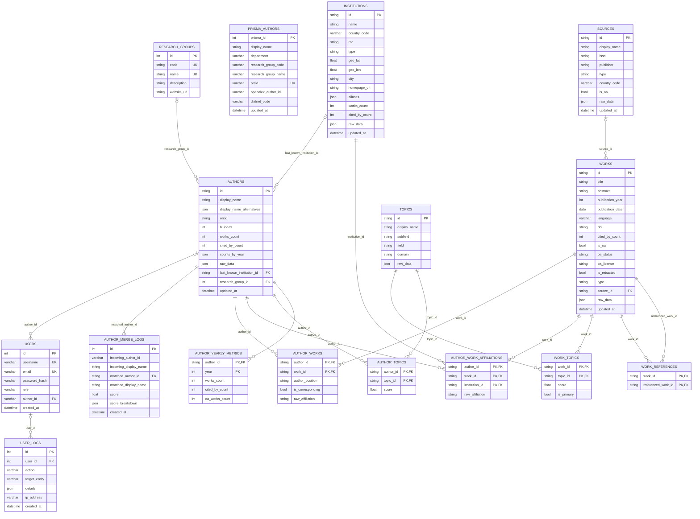

```mermaid
erDiagram
    USERS {
        int id PK
        varchar username UK
        varchar email UK
        varchar password_hash
        varchar role
        varchar author_id FK
        datetime created_at
    }

    USER_LOGS {
        int id PK
        int user_id FK
        varchar action
        varchar target_entity
        json details
        varchar ip_address
        datetime created_at
    }

    AUTHORS {
        string id PK
        string display_name
        json display_name_alternatives
        string orcid
        int h_index
        int works_count
        int cited_by_count
        json counts_by_year
        json raw_data
        string last_known_institution_id FK
        int research_group_id FK
        datetime updated_at
    }

    RESEARCH_GROUPS {
        int id PK
        string code UK
        string name UK
        string description
        string website_url
    }

    PRISMA_AUTHORS {
        int prisma_id PK
        string display_name
        varchar department
        varchar research_group_code
        varchar research_group_name
        varchar orcid UK
        varchar openalex_author_id
        varchar dialnet_code
        datetime updated_at
    }

    AUTHOR_MERGE_LOGS {
        int id PK
        varchar incoming_author_id
        string incoming_display_name
        string matched_author_id FK
        string matched_display_name
        float score
        json score_breakdown
        datetime created_at
    }

    INSTITUTIONS {
        string id PK
        string name
        varchar country_code
        string ror
        string type
        float geo_lat
        float geo_lon
        string city
        string homepage_url
        json aliases
        int works_count
        int cited_by_count
        json raw_data
        datetime updated_at
    }

    SOURCES {
        string id PK
        string display_name
        string issn
        string publisher
        string type
        varchar country_code
        bool is_oa
        json raw_data
        datetime updated_at
    }

    WORKS {
        string id PK
        string title
        string abstract
        int publication_year
        date publication_date
        varchar language
        string doi
        int cited_by_count
        bool is_oa
        string oa_status
        string oa_license
        bool is_retracted
        string type
        string source_id FK
        json raw_data
        datetime updated_at
    }

    TOPICS {
        string id PK
        string display_name
        string subfield
        string field
        string domain
        json raw_data
    }

    AUTHOR_WORKS {
        string author_id PK, FK
        string work_id PK, FK
        string author_position
        bool is_corresponding
        string raw_affiliation
    }

    AUTHOR_WORK_AFFILIATIONS {
        string author_id PK, FK
        string work_id PK, FK
        string institution_id PK, FK
        string raw_affiliation
    }

    WORK_TOPICS {
        string work_id PK, FK
        string topic_id PK, FK
        float score
        bool is_primary
    }

    AUTHOR_TOPICS {
        string author_id PK, FK
        string topic_id PK, FK
        float score
    }

    WORK_REFERENCES {
        string work_id PK, FK
        string referenced_work_id PK, FK
    }

    AUTHOR_YEARLY_METRICS {
        string author_id PK, FK
        int year PK
        int works_count
        int cited_by_count
        int oa_works_count
    }

    AUTHORS o|--o{ USERS : author_id
    USERS o|--o{ USER_LOGS : user_id
    INSTITUTIONS o|--o{ AUTHORS : last_known_institution_id
    RESEARCH_GROUPS o|--o{ AUTHORS : research_group_id
    AUTHORS ||--o{ AUTHOR_MERGE_LOGS : matched_author_id
    SOURCES o|--o{ WORKS : source_id
    AUTHORS ||--o{ AUTHOR_WORKS : author_id
    WORKS ||--o{ AUTHOR_WORKS : work_id
    AUTHORS ||--o{ AUTHOR_WORK_AFFILIATIONS : author_id
    WORKS ||--o{ AUTHOR_WORK_AFFILIATIONS : work_id
    INSTITUTIONS ||--o{ AUTHOR_WORK_AFFILIATIONS : institution_id
    WORKS ||--o{ WORK_TOPICS : work_id
    TOPICS ||--o{ WORK_TOPICS : topic_id
    AUTHORS ||--o{ AUTHOR_TOPICS : author_id
    TOPICS ||--o{ AUTHOR_TOPICS : topic_id
    WORKS ||--o{ WORK_REFERENCES : work_id
    WORKS ||--o{ WORK_REFERENCES : referenced_work_id
    AUTHORS ||--o{ AUTHOR_YEARLY_METRICS : author_id
```